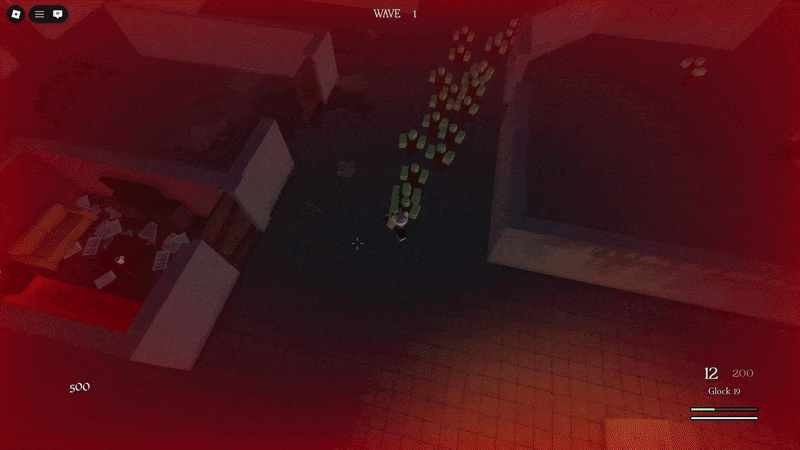
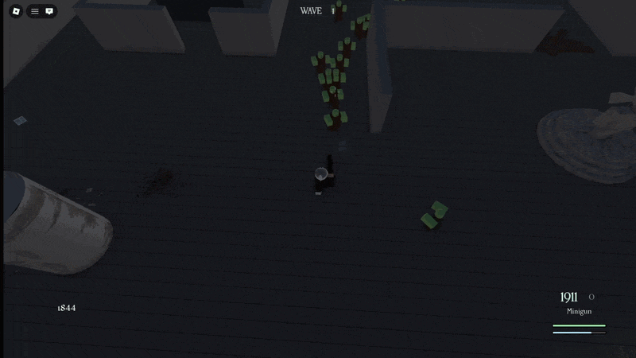
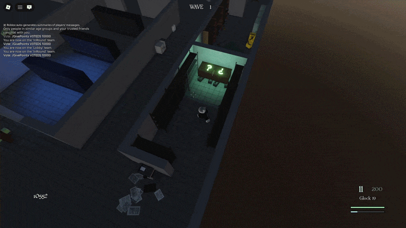
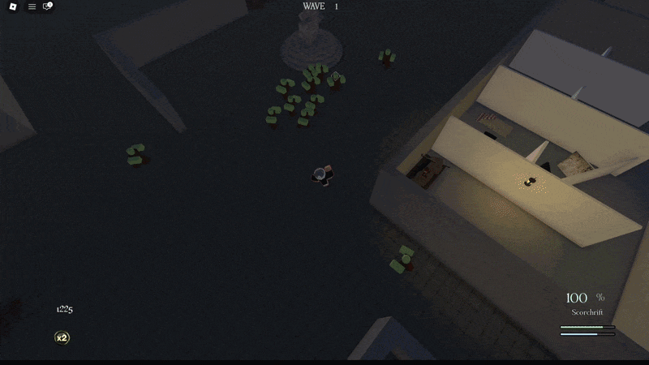
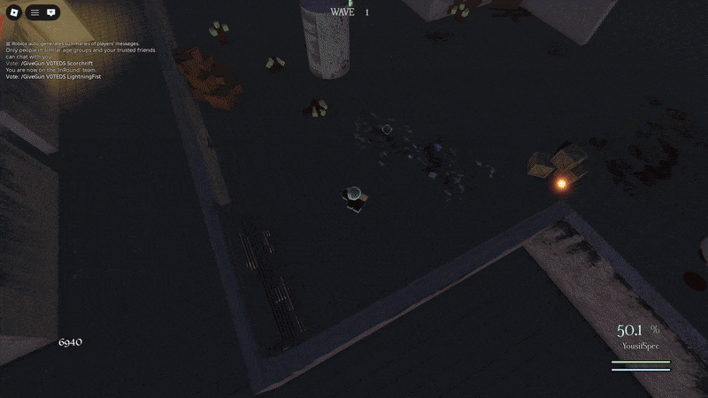

# Zombest

**A multiplayer zombie survival game built with Luau and Roblox Studio**

[▶ Play on Roblox](https://www.roblox.com/games/126463617374732/Zombest)

---

## 📖 Overview

Zombest is a multiplayer zombie survival game developed independently in Roblox Studio using Luau, rendered from an isometric-style top-down perspective. Players survive escalating waves of zombies, purchase and roll for weapons, and compete on a persistent global leaderboard of highest waves reached.

The project contains roughly 36,000 lines of Luau across 131 scripts. All code, animations, VFX, and GUI were designed and built independently. It features a custom zombie AI system, a server-authoritative combat architecture, real-time multiplayer networking, a fully implemented round and wave system, and a suite of custom engine-level systems built to replace Roblox's defaults where they fell short.

---

## 🎮 Gameplay

*Zombie Horde and Blood Screen Tint*

*Minigun in Action + Zombie Drops*

*Mystery Box*

*Scorchrift — Legendary Weapon*

*Lightning Charge*

---

## ✨ Features

### 🔫 Combat & Weapons

- **Weapon system** — 20 weapon definitions across two bullet types (standard projectile and laser/stream). Players carry two weapon slots, with separate weapons assigned for the knocked state.
- **Cursor-driven aiming** — the character rotates to face your cursor at all times. Rotation speed slows down based on weapon weight and whether you're actively firing, so heavier guns feel heavier to swing around.
- **Recoil system** — holding fire spreads your shots progressively up to a per-weapon cap. Each weapon has its own recoil curve, so burst firing is always more accurate than spraying.
- **Dual reload system** — most weapons reload the full magazine at once, while shotguns load shell by shell. Both can be cancelled mid-reload by sprinting or dashing, keeping however many rounds were loaded.
- **Charge system** — laser weapons build charge passively after a cooldown. You can also trigger a manual full charge that's faster but roots you in place — high risk, high reward.
- **Weapon-specific effects** — ricochets, piercing shots, area damage, and chain lightning give weapons distinct behavior; LightningFist also grants a temporary speed boost after manual charging
- **Status effect system** — some weapons apply burn (damage over time with fire visuals on the zombie) or stun (temporary immobilization). All effects are synced between server and client.

---

### 🧟 Gameplay Systems

- **Wave-based survival** — survive escalating zombie waves, earn points from kills, with difficulty scaling each round
- **Lobby system** — players wait in a shared lobby between rounds with a live countdown before teleporting to the map
- **Weapon shop** — spend points on weapons, each with individually tuned weight and recoil that affects how they feel to use
- **Mystery box** — roll for a random weapon from tiered rarities. A failed roll moves the box to a new spot on the map, with a custom animation and VFX sequence
- **Zombie drops** — shared pickups include timed Insta-Kill and Double Points buffs, plus instant Max Ammo and Bonus Points rewards, with visual indicators for active buffs
- **Knocked & revive** — players go down instead of dying instantly, giving teammates a window to revive them before full elimination
- **Ragdoll system** — custom physics ragdoll on death for both players and zombies, built entirely from joint motors and constraints at runtime with no pre-made animations

---

### 🏃 Movement

- **Movement system** — custom controller with sprinting, dashing, and directional character tilt based on movement input. Weapon weight affects both move speed and rotation feel at runtime.
- **Stamina** — controls sprint and dash, disabling both when empty and regenerates over time

---

### 🌐 Multiplayer & Networking

- **Server-authoritative zombies** — the server manages zombie state and sends distance-filtered position updates; clients render and interpolate the visible models
- **Server-authoritative projectiles** — bullets are processed and validated server-side while remaining invisible on the server. Each client renders its own visual representation independently for performance
- **Real-time scoreboard** — kills, deaths, revives, knockdowns, and current points update through replicated attribute-change signals
- **MVP system** — at the end of each round, the top-performing player is recognized based on composite statistics tracked server-side throughout the session
- **Server-side combat checks** — the server checks weapon state, ammunition, fire timing, and conflicting actions, and calculates damage and points
- **Object pooling** — a shared bullet pool reuses instances rather than creating and destroying them on every shot, maintaining performance stability during high-volume combat

---

### ⚙️ Technical Systems

- **Game state machine** — round lifecycle runs through: Lobby → Round Start → Player Teleport → Wave Active → Wave Clear/Results, with handling for players who join mid-round
- **Custom AABB collision grid** — replaced Roblox's built-in zombie collision with a custom spatial grid, improving performance in heavy-collision scenarios
- **Custom camera** — a top-down view with full rotation, scroll-wheel zoom, sprint zoom, recoil shake, and local occlusion handling
- **Spectator system** — dead players can switch the custom camera between other players
- **Admin command system** — admins can type commands directly into the in-game chat to trigger server-side actions during live sessions. Commands are parsed from chat input, validated against an admin whitelist server-side, and rejected silently if the sender lacks permission
- **Client-side asset loading** — server signals trigger weapon models, VFX, sounds, and animations on each client, with bounded retries and lifecycle cleanup
- **Custom sound positioning** — built a sound system using pooled parts placed at exact world-space positions, bypassing Roblox's default audio which anchors to a part's center rather than the actual origin point
- **Custom UI framework** — all menus and HUD elements built from scratch, updated dynamically from live game data
- **ModuleScript architecture** — systems are split into decoupled, reusable modules throughout the codebase

---

## 🧠 Technical Highlights

**Complete Zombie System — Scaling Beyond Roblox's Limits**

The main challenge with Zombest was getting 200+ zombies running smoothly at the same time. Roblox's default NPC setup can't handle that kind of scale, so the entire zombie system had to be rebuilt from scratch.

**Problem 1 — Network Overload with Server-Side NPCs**
Running all NPCs fully server-side at high counts caused too much network traffic and frequent frame drops. The fix was a custom replication system that adjusts each zombie's update rate based on how relevant it is to each player. The server sends moving-zombie updates on a roughly 0.05-second cadence and filters distant zombies for eligible players. Clients handle the detailed models and animations while the server retains simulation and combat state.

**Problem 2 — Humanoid Performance at Scale**
Roblox's Humanoid object is too expensive to run on hundreds of NPCs at once. It was removed from every zombie and replaced with lightweight custom controllers, which meant rebuilding movement, health tracking, and state management from scratch.

**Problem 3 — Choppy Client-Side Movement**
Without a humanoid, moving zombies each frame from raw server data looked stuttery. Delta-time lerp interpolation was added between position updates, smoothing movement between server ticks and automatically accounting for different client frame rates.

**Problem 4 — Zombie-Map Collision Without a Humanoid**
Removing the humanoid also removed Roblox's built-in collision handling. A custom AABB spatial grid was built to replace it, tracking each zombie's grid cell and pushing them away from walls on overlap. This also fixed the common bug of zombies clipping through geometry during collision resolution.

**Problem 5 — Zombie-Zombie Collision and Wall Clipping**
Using the same grid, zombie-to-zombie collisions are resolved by gradually applying a separation force between overlapping zombies over time rather than snapping them apart instantly. Wall-aware logic was added so zombies being pushed apart don't get forced through nearby walls in the process.

**Problem 6 — Network Bandwidth at Scale**
Sending raw uncompressed data for 200 zombies per frame used too much bandwidth. The replication layer packs each zombie update into 10 bytes: a two-byte ID, three quantized two-byte position coordinates, and a two-byte yaw. Positions are encoded to tenths of a stud and yaw to thousandths of a radian, trading precision for smaller payloads.

**Problem 7 — Pathfinding Computation at Scale**
Pathfinding calls are expensive, and naively running them for 100+ zombies every frame would stall the server. Two optimizations were combined: updates are staggered across multiple frames so only a subset of zombies recalculate per tick, and a raycast check runs before each call to test for a clear line of sight. If the zombie can see its target directly, pathfinding is skipped entirely and it moves straight there, reserving the expensive calls for cases where obstacle avoidance is actually needed.

**Problem 8 — Zombie Spawning Without Disrupting Players**
Spawning zombies at fixed and random positions caused two problems: zombies spawning directly on top of players, and spawns appearing too far or too close relative to where players actually were on the map. A score-based spawning algorithm was built to solve this. Each candidate spawn point is evaluated against every player's current position simultaneously, scoring each point based on distance, proximity thresholds, whether it would result in an overlap, and if the spawn location was used very recently. The spawn point with the best overall score across all players is chosen, producing spawns that feel fair and consistent regardless of where players are at any given moment.

**Result**
The system combines client-side model control, humanoid-free server controllers, delta-time interpolation, AABB spatial collision, and packed buffer replication to support large zombie hordes.

---

**Complete Bullet System — Smooth, Visible Bullets at Scale**

Zombest renders moving projectiles with weapon-specific effects on each client while the server processes bullet state and hit detection.

**Problem 1 — Server-Side Bullet Creation Cost**
Creating bullet instances on the server for every shot was slow and caused unnecessary replication to all clients. Bullets were moved entirely to the client — the server only keeps a lightweight reference to each bullet's state while each client builds and owns its own visuals. This also made movement smoother since client-side instances render without waiting on the server.

**Problem 2 — Instance Creation Overhead at High Fire Rates**
Even client-side, creating and destroying instances at high fire rates (a minigun firing 20+ rounds per second, for example) was too expensive due to repeated engine-level allocation. Each client initializes pools of 1,500 regular bullet instances and 500 instances for each other bullet type. Casings are pooled separately. Pooled instances are reused when bullets expire, reducing repeated instance creation during firing.

**Problem 3 — Hit Detection Performance**
The original approach used OverlapParams to check what's inside each bullet every frame. At 100+ simultaneous bullets this became a real bottleneck. Hit detection was rewritten using frame-to-frame raycasting, casting a ray from the bullet's previous position to its current one each frame. It's significantly cheaper and also prevents fast bullets from passing through thin geometry.

**Problem 4 — Bullets Firing Through Walls**
With a top-down perspective, long gun models can clip into thin walls at the muzzle, causing bullets to spawn on the wrong side of geometry. Blocking shots near walls wasn't viable since some weapons have intentional near-wall effects like ricochets and AoE splashes that need wall proximity to work.

A custom multi-sample raycast system was built instead. Multiple raycasts fire ahead of the bullet each frame, each one checking the type of object hit and the bullet's current age to decide the right behavior at that position. The system accounts for muzzle-wall intersections while preserving weapon-specific near-wall effects.

**Result**
The bullet system combines client-side visuals, pooled instances, frame-to-frame raycasts, and weapon-specific wall interactions.

---

**Runtime Data Architecture — Separated Client and Server State**

With players, zombies, guns, and bullets all running at once, state needed a clear structure. Every entity type follows the same pattern: a server record and a client record.

Client records organize visual and presentation state, while server records manage combat health, weapon state, scoring, and points. Clients also provide input to the server, where action-specific checks determine how it is processed.

Each data type has its own module with a consistent interface: create, get, remove, and clean. Any system can access or update entity state without knowing how it's stored internally, which keeps inter-module dependencies minimal and the data layer easy to reason about.

When a new entity is created, its data is built from a deep clone of a preset template for that type. Templates give new instances consistent default fields and centralize changes to those defaults.

---

**Custom Camera System — Isometric Perspective with Dynamic Occlusion**

Roblox's camera is designed for third-person and first-person games with no native support for a fixed isometric view. The entire controller was replaced with a custom implementation running on RunService.RenderStepped, updating the view on every rendered frame.

The camera sits at roughly 60 degrees above the player and supports full 360-degree rotation, giving players full spatial awareness during combat.

**Problem — Walls Blocking the Player**
A fixed isometric camera will eventually have walls between it and the player as you move around the map. Locking rotation to avoid this wasn't an option since free camera movement is a core part of the gameplay.

Inspired by Project Zomboid, tagged structures along the camera-to-player ray become partially transparent locally. Their original transparency is restored shortly after they stop obstructing the view. The map looks normal everywhere except where it needs to get out of the way.

---

**Custom Client-Side Asset Loading**

Zombest triggers a lot of assets at runtime: weapon animations, VFX, hit effects, and sounds, often all at once across multiple players. Having the server manage all of that directly would get expensive fast as player count grows.

Instead, the server sends a single lightweight signal to each relevant client and steps back. Each client loads and plays its own asset instances independently from that point, including assets for other players visible to them. The server fires once and is done.

A retry system handles failed loads, automatically retrying up to 100 times before giving up. Asset handlers include cleanup for temporary instances and event connections at the end of their lifecycle.

---

**Original Art & Animation**

All VFX and animations in Zombest were made from scratch. Roblox's particle emitter system was used to build effects for every weapon and combat interaction, tuning emission rate, lifetime, size curves, and velocity until each one felt right in gameplay.

Animations started in Roblox's built-in editor, then moved to Moon Animator for more control over rigging and keyframes. Every weapon, character, and ability animation across the weapon roster is original.

---

## 🛠️ Built With

| Technology | Purpose |
|---|---|
| Roblox Studio | Game engine and development environment |
| Visual Studio Code | Primary code editor for later-stage development, replacing Roblox Studio's built-in editor |
| Rojo | Build tool syncing VS Code project files to Roblox Studio in real time |
| Luau | Primary scripting language (Roblox's typed superset of Lua) |
| DataStoreService | Persistent storage for global leaderboard rankings and player wave records |
| PathfindingService | Built-in A* pathfinding for zombie navigation; extended with custom raycast pre-checks and staggered frame updates |
| RemoteEvents / RemoteFunctions | Client-server inputs, state updates, and visual-effect signals |
| RunService | Frame-by-frame game loop driving camera updates, bullet movement, and zombie replication |
| UserInputService | Client-side keyboard and mouse input detection for movement, aiming, and weapon controls |
| TweenService | Property-based animation system used for UI transitions, mystery box sequences, and environmental effects |
| DebrisService | Automatic part lifetime management for short-lived instances, reducing manual cleanup overhead |
| ReplicatedFirst | First-loaded container used to display a custom loading screen before the game world initializes |

> A wide range of additional Roblox engine services were used throughout development — the above highlights those most central to the game's core systems.
---

## 📊 Stats

| Metric | Value |
|---|---|
| Lines of Luau | ~36,000 |
| Luau scripts | 131 |
| Development started | June 29, 2025 |
| Development | Solo — all code, animations, VFX, and GUI built independently |

---

## 🧰 Source Code

This repository showcases the Luau source code behind Zombest for portfolio review. Some assets require permissions associated with the my account, so the source is provided for reviewing the game's implementation and architecture rather than as a standalone runnable project.

[Play Zombest on Roblox](https://www.roblox.com/games/126463617374732/Zombest).

| Path | Contents |
|---|---|
| `zombestPlace.rbxl` | Existing place containing the world and Studio objects |
| `src/ServerScriptService` | Server combat, rounds, zombies, player state, and leaderboard logic |
| `src/ReplicatedStorage/ModuleScripts` | Client state, shared helpers, weapon assets, and visual systems |
| `src/StarterPlayer` | Camera, movement input, combat input, and player/zombie presentation |
| `src/StarterGui` | GUI models and their client scripts |

### Desktop Controls

| Action | Input |
|---|---|
| Fire | Left mouse button |
| Reload / manually charge | R |
| Switch weapon slot | 1 / 2 |
| Sprint | Hold Left Shift |
| Dash | Q |
| Rotate camera | Hold right mouse button and drag |
| Zoom | Mouse wheel |
| Scoreboard | Hold Tab |

---

## 🗓️ Development History

Development began on **June 29, 2025**, in Roblox Studio, before I started using GitHub for the project. I was only able to integrate my existing Studio project with Rojo late in development, so this repository's commit history begins in **April 2026** and does not cover the earlier work.

Development was paused for most of January through the end of March 2026.

I kept a daily development log documenting the work throughout development. **The log is available upon request** for anyone interested in the project's progress before it was added to GitHub.

---

## 🧩 What I Learned

- **Luau & Roblox engine** — went from basic scripting to knowing the engine well enough to build or replace any system from scratch
- **Client-server architecture** — learned how to cleanly separate what the client owns from what the server owns, and why that separation matters for both performance and security
- **Performance engineering** — learned to profile, find bottlenecks, and fix them through object pooling, spatial partitioning, buffer compression, LOD systems, and staggered computation
- **State management** — built state machines for overlapping player states (shooting, reloading, sprinting, dashing, knocked, etc) without them conflicting with each other
- **Runtime data architecture** — designed a consistent data system across every entity type with separated client and server records and template-based initialization
- **Problem solving** — kept running into hard engine limits and rebuilt systems from scratch rather than working around them. Treating every bottleneck as a solvable problem became a habit.

---

## 📬 Contact

**Mayar Al Jawhary**
📧 [mayar.aljwh@gmail.com](mailto:mayar.aljwh@gmail.com)
💼 [linkedin.com/in/mayar-al-jawhary-9b6497390](https://www.linkedin.com/in/mayar-al-jawhary-9b6497390/)
🐙 [github.com/mayaralj](https://github.com/mayaralj)
🎮 [roblox.com/users/1244545245/profile](https://www.roblox.com/users/1244545245/profile)
---

Copyright © 2026 Mayar Al Jawhary. All rights reserved.
